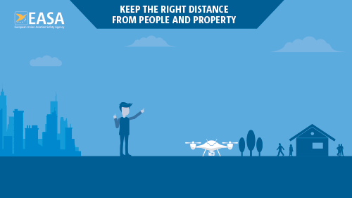
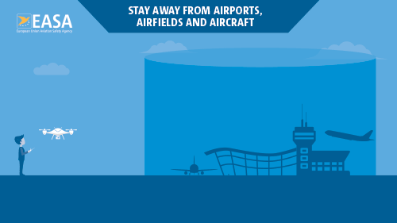

# Flying Drones in German - Rules, Regulations, Licenses, Insurance, and Safety

## Disclaimer

I am just a drone operator and not an expert or professional in this field. I have documented my findings in this
article. This article is neither an official nor regulatory documentation. Readers are advised to always follow the
official guidelines to comply with the official regulations. This is just a step-by-step walkthrough that I followed
for a successful drone flight in Germany. Please do not rely 100% on this walkthrough as the rules can get changed at
any time. I will not be responsible for any violence you make whatsoever.

## About

I didn't have any idea about drones when I get started. So, I started from zero and documented my knowledge in this
article. [European Union Aviation Safety Agency (EASA)](https://www.easa.europa.eu/) is the regulatory body for flying
drones in EU. This article will contain information on flying drones in Germany. When I started, I didn't know where to
look for the information. After researching for weeks, I found the right sources to look for. In this article, I am
documenting the sources that I have referred to successfully taking a flight with my drone. After reading the contents
mentioned in this article, you will also be able to fly the drone with all requirements fulfilled. I will not write any
specific rules and regulations in this article because rules and regulations are subject to change and are operated by
EASA and Aircraft Authorities.

## Step 1 - Where to look for information?

* [European Union Aviation Safety Agency (EASA)](https://www.easa.europa.eu/)
  * Source: [Drone Laws in Germany | UAV Coach (2022)](https://uavcoach.com/drone-laws-in-germany/)
* [Germany | EASA](https://www.easa.europa.eu/light/topics/germany)
* [Drones (UAS) | EASA](https://www.easa.europa.eu/the-agency/faqs/drones-uas)

## Step 2 - Get started

### Flying a drone - How to be a safe drone pilot | EASA

Source: [Flying a drone - How to be a safe drone pilot | EASA](https://www.easa.europa.eu/light/topics/flying-drone-how-be-safe-drone-pilot)

Source: [EASA Drones - Safe drone operations - Meet Donnie & Paul | YouTube](https://www.youtube.com/watch?v=l6xHV61jwGo)

## Infographics for Drones | EASA

Source: [Infographics for Drones| EASA](https://www.easa.europa.eu/downloads/120953/en)

## Step 3 - Drone operators and pilots

* [Drone operators & pilots | EASA](https://www.easa.europa.eu/light/topics/drone-operators-pilots)
