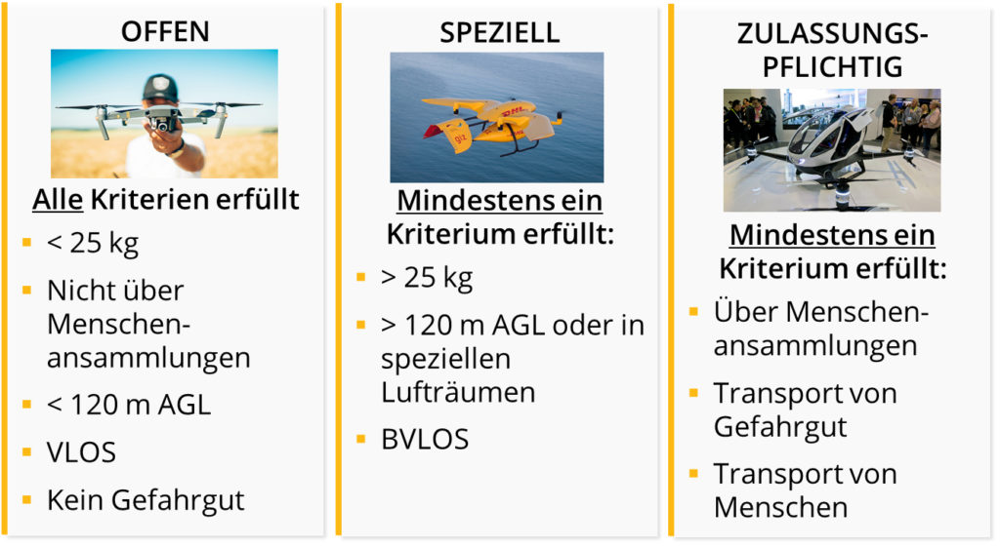
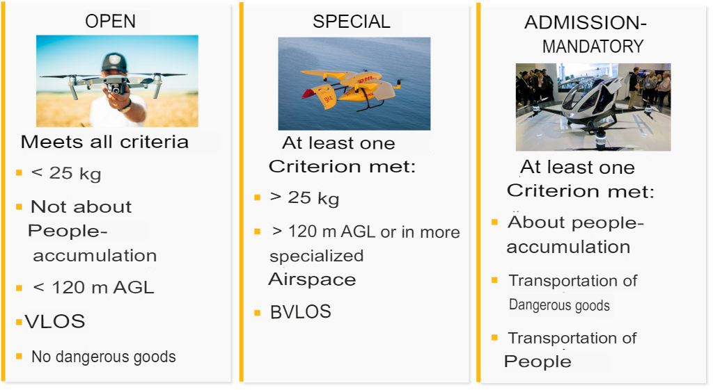

# Training

* [Started - LBA - OpenUAV](https://lba-openuav.de/einstieg/)
* [Teaching Material – LBA – OpenUAV](https://lba-openuav.de/onlinekurs/lehrmaterial/)

## Air Law and Safety

Source: [Air Law and Safety – LBA – OpenUAV](https://lba-openuav.de/onlinekurs/lehrmaterial/luftrecht-und-sicherheit/)

### UAS classifications

Source: [UAS Classifications - LBA - OpenUAV](https://lba-openuav.de/onlinekurs/lehrmaterial/luftrecht-und-sicherheit/uas-klassifizierungen/)
[PDF](files/training/1-air-law-and-safety/1-uas-classifications/uas-classifications.pdf)

#### Unmanned Aircraft System

* USA = Unmanned Aircraft System
  * An unmanned aerial vehicle is any aircraft that is not operated by an on-board pilot.
  * This means either that no pilot controls the UAS at all (in the case of autonomously flying drones, drone taxis,
  packet drones) or that a remote pilot has control of the flight from the ground using a suitable remote control.
  * Some unmanned aerial vehicles even have passengers on board - and yet they are called unmanned aerial vehicles.

#### UAS categories

* The EASA regulations apply to most UAS, which divide the operation of UAS into three categories:
  * OPEN
  * SPECIAL
  * CERTIFIED
* In addition, there are special cases that are not covered by the EASA regulations:
  * UAS that are operated indoors (e.g. mini drones for the living room), and
  * unmanned aircraft used by the military, police, fire brigade, border guards, customs and coast guard, for example.

##### Abbreviations

* AGL = Above Ground Level
* BVLOS = Beyond Visual Line of Sight
