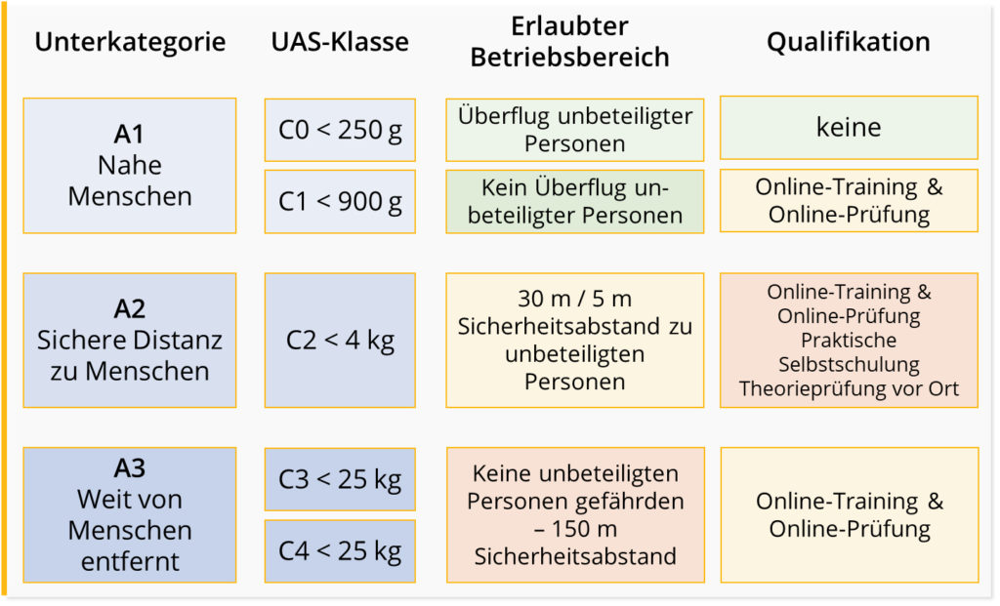
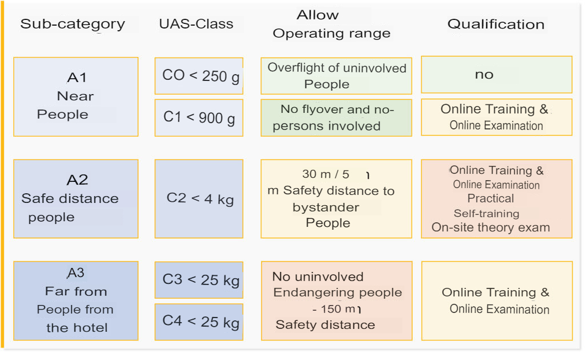

# Training

* [Started - LBA - OpenUAV](https://lba-openuav.de/einstieg/)
* [Teaching Material – LBA – OpenUAV](https://lba-openuav.de/onlinekurs/lehrmaterial/)

## Air Law and Safety

Source: [Air Law and Safety – LBA – OpenUAV](https://lba-openuav.de/onlinekurs/lehrmaterial/luftrecht-und-sicherheit/)

### UAS classifications

* Source: [UAS Classifications - LBA - OpenUAV](https://lba-openuav.de/onlinekurs/lehrmaterial/luftrecht-und-sicherheit/uas-klassifizierungen/)
* [PDF](files/training/1-air-law-and-safety/1-uas-classifications/uas-classifications.pdf)

##### Abbreviations

* USA = Unmanned Aircraft System
* AGL = Above Ground Level
* VLOS = Visual Line of Sight
* BVLOS = Beyond Visual Line of Sight
